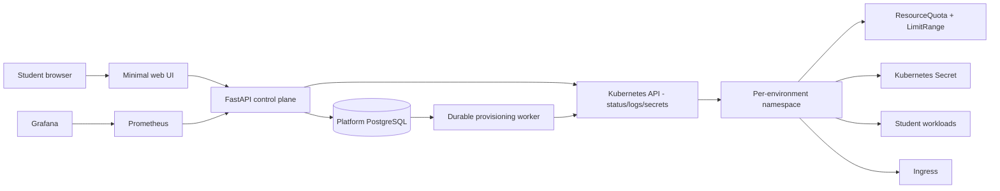

# Student Platform — self-service platform-engineering MVP

A small self-service platform for college students who need a working technical environment but should not have to become Kubernetes operators first.

The interaction is intentionally application-first:

> Student: “I need FastAPI, PostgreSQL, and Redis.”  
> Platform: “Your environment is ready.”

The platform hides namespaces, Deployments, Services, Ingress, Secrets, quotas, and lifecycle mechanics from the normal UI.

## Golden paths

Only two environment templates exist in V1:

- **Backend:** FastAPI + PostgreSQL + Redis
- **Data:** Jupyter + Apache Spark + MinIO

The Data template uses the Jupyter PySpark image, so Spark is available inside the Jupyter environment instead of adding a separate Spark cluster. That is deliberate for a ~10-user MVP: it demonstrates the abstraction without creating an unnecessary distributed Spark control plane.

## Architecture



### Why a modular monolith + worker?

The API, domain models, provisioning logic, Kubernetes adapter, and observability code live in one Python codebase. Provisioning runs in a separate process because an HTTP request must not wait for Kubernetes. The queue is **PostgreSQL-backed**, using `SELECT ... FOR UPDATE SKIP LOCKED`. For this MVP that is more durable than FastAPI background tasks and simpler than operating RabbitMQ/Kafka/Celery infrastructure just to support ten students.

If the API restarts, queued jobs remain. If a worker dies after claiming a job, stale jobs are reclaimed. Kubernetes resource creation is deterministic and create-or-patch, making retries idempotent.

## Request-to-provisioning flow

1. `POST /api/environments` validates the template and per-user environment limit.
2. An `Environment` row is created with status `requested`.
3. A durable `ProvisioningJob` row is queued.
4. The worker sets the environment to `provisioning`.
5. It ensures the namespace exists.
6. It applies `ResourceQuota` and `LimitRange`.
7. It creates a unique Kubernetes Secret.
8. It deploys the template workloads and internal Services.
9. It creates an Ingress route.
10. It waits for deployment readiness.
11. Component health is persisted.
12. The environment becomes `running` and the UI shows its URL.

An `Idempotency-Key` header on `POST /api/environments` prevents accidental duplicate requests. Every Kubernetes object has a deterministic name, so worker retries continue from partial state.

## Domain model

- `User`
- `EnvironmentTemplate`
- `Environment`
- `Deployment`
- `ProvisioningJob`
- `ResourceAllocation`
- `EnvironmentStatus`

Environment states: `requested`, `provisioning`, `running`, `failed`, `stopping`, `stopped`, `deleting`, `deleted`.

## Local setup

### Prerequisites

- Docker Desktop / Docker Engine
- Python 3.12
- `kubectl`
- `k3d`

k3d was chosen because it runs real **k3s inside Docker**, is lighter than a traditional multi-node Kubernetes install, and makes it easy to expose local Traefik ingress on a predictable port.

### 1. Create Kubernetes

```bash
./scripts/create-k3d.sh
```

This creates `student-platform`, maps local port `8081` to Traefik port `80`, builds the sample FastAPI student workload image, and imports it into k3d.

### 2. Bootstrap the control plane

```bash
./scripts/bootstrap.sh
```

Set a real `JWT_SECRET` in `.env` before sharing the platform.

### 3. Run the API

```bash
source .venv/bin/activate
uvicorn app.main:app --reload
```

### 4. Run the worker

```bash
source .venv/bin/activate
python -m app.workers.worker
```

Open `http://localhost:8000`.

## Demo workflow

1. Register.
2. Click **Provision** on Backend.
3. The UI immediately shows requested/provisioning.
4. The worker creates isolation, quotas, secret, workloads, networking, and ingress.
5. Status changes to Running.
6. Open the displayed `*.localhost:8081` URL.
7. View logs or credentials.
8. Stop, restart, then delete the environment.
9. Repeat with Data and open Jupyter using the generated token.

## REST API

- `POST /api/auth/register`
- `POST /api/auth/login`
- `GET /api/templates`
- `GET /api/templates/{id}`
- `POST /api/environments`
- `GET /api/environments`
- `GET /api/environments/{id}`
- `GET /api/environments/{id}/status`
- `GET /api/environments/{id}/credentials`
- `GET /api/environments/{id}/logs`
- `POST /api/environments/{id}/stop`
- `POST /api/environments/{id}/start`
- `DELETE /api/environments/{id}`
- `GET /health`
- `GET /ready`
- `GET /metrics`

## Failure handling

**Kubernetes API unavailable:** the worker records the exception and retries up to `JOB_MAX_ATTEMPTS`; `/ready` returns 503.

**Pod/image/readiness failure:** `wait_ready()` times out and records the failure on the environment. The namespace stays labeled and owned by the environment record rather than becoming an unmanaged orphan.

**Namespace already exists:** HTTP 409 becomes create-or-patch continuation.

**Duplicate request:** same user + `Idempotency-Key` returns the existing environment.

**API restart:** no provisioning state exists only in API memory.

**Worker restart:** stale claimed jobs are returned to `queued` and retried.

**Partial creation:** deterministic resource names make reconciliation safe; deleting the environment deletes the namespace and its scoped resources.

Errors are persisted and logged, never silently swallowed by the worker.

## Resource controls

Every environment gets namespace isolation, `ResourceQuota`, `LimitRange`, unique credentials, an expiration timestamp, and a configurable active-environment limit per user. Defaults: 2 CPU, 3 GiB memory, 5 GiB requested storage, and 8 pods.

`python -m app.workers.expiry` enqueues deletion of expired environments. Schedule that command periodically for V1.

## Security limitations

Namespaces are useful organization/policy boundaries, **not hard hostile-tenant isolation**. V1 does not yet add NetworkPolicies, Pod Security admission, runtime sandboxing, tenant-specific Kubernetes identities, node isolation, egress controls, image admission policy, or external secret management. Students do not receive Kubernetes credentials, which removes a major attack surface.

The authenticated credentials endpoint returns the owner’s generated workload secrets. Production should prefer short-lived credentials and narrower exposure.

## Observability

`/metrics` exports request counts/latency, provisioning duration, provisioning success/failure, and running-environment count. Application logs are structured JSON. A starter Grafana dashboard lives at `kubernetes/monitoring/grafana-dashboard.json`.

```bash
docker compose -f docker-compose.monitoring.yml up -d
```

Prometheus: `http://localhost:9090`  
Grafana: `http://localhost:3000`

Cluster-level CPU/memory metrics are intentionally deferred; add kube-state-metrics later.

## Tests

```bash
pytest
```

Coverage includes authentication, authorization, creation, idempotency, provisioning transitions, persisted failures, and quota generation. Kubernetes is faked in unit tests.

Optional real-cluster connectivity test:

```bash
RUN_K8S_INTEGRATION=1 pytest tests/test_integration_provisioning.py
```

## CI/CD

`.github/workflows/ci.yml` installs dependencies, runs Ruff, runs tests with coverage, builds the control-plane image, builds the student FastAPI image, and validates the Grafana dashboard JSON. Production release automation is deliberately deferred.

## Cost-conscious decisions

- one small k3s cluster
- PostgreSQL for metadata **and** the durable job queue
- no Kafka/RabbitMQ/Celery infrastructure
- modular monolith + one justified worker
- k3s-bundled Traefik
- Spark bundled with the Jupyter PySpark image
- only two golden paths
- no billing, marketplace, university admin, enterprise RBAC, or AI layer

## Known limitations

- No NetworkPolicy / Pod Security hardening yet.
- Student workload images are not pinned/signed.
- PostgreSQL and MinIO student data are ephemeral in this first runnable version; PVCs are the first infrastructure improvement.
- Data uses Spark embedded in the PySpark Jupyter image, not a standalone Spark cluster.
- Expiration cleanup is a command to schedule, not a dedicated scheduler service.
- The running-environment Prometheus gauge is process-local and can drift after restarts.
- Credentials are retrievable as plaintext by the authenticated owner.
- The minimal frontend stores its JWT in browser localStorage.

## Production-scale changes

At larger scale: dedicated queue, continuous reconciler/controller, NetworkPolicies + pod hardening, external secrets, durable storage classes, production DNS/TLS, workload identity, multiple workers, template versioning, admission policy, and continuously reconciled desired-vs-actual state.

## Recommended next 5 improvements

1. **Storage lifecycle** — retention policy, snapshots, backup/restore, and explicit PVC deletion semantics.
2. **Network and pod security** — default-deny NetworkPolicies, service accounts, Pod Security Standards.
3. **Continuous reconciler** — periodically compare desired DB state with Kubernetes and heal drift.
4. **Expiry scheduler** — reliable scheduled cleanup with pre-expiration notification.
5. **Production ingress + TLS** — wildcard DNS, certificates, stable URLs, then external load balancing when needed.

## Design principle

The database stores **desired platform intent and lifecycle state**. Kubernetes is an implementation detail behind a narrow adapter. The browser talks about Backend, Data, Running, Stop, Delete, Logs, and Credentials — never pods, Deployments, namespaces, Helm releases, or ingress classes.
